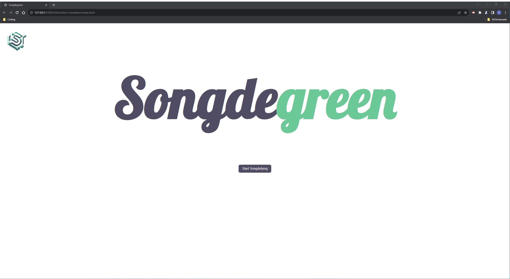
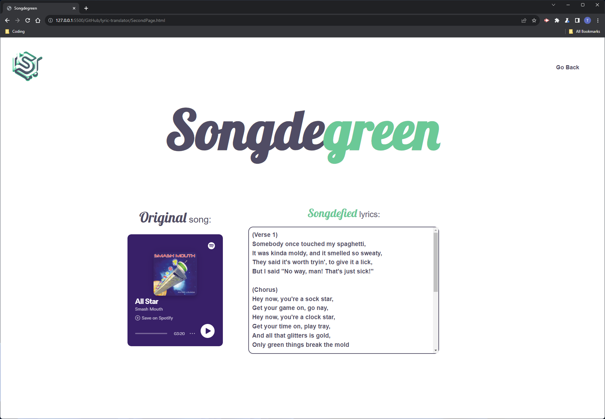

# Songde*green*
Derived from the work *mondegreen* meaning "a misunderstood or misinterpreted word or phrase resulting from a mishearing of the lyrics of a song."

For example,

    'I'm a Believer' by The Monkees:
    - Mondegreen: "Then I saw her face, now I'm gonna leave her"
    - Correct: "Then I saw her face, now I'm a believer"

## Description
- This application essentially allows you to recreate an endless amount of different "mondegreened" lyrics out of your favourite song!
- It is written in HTML, CSS and plain JS, leveraging **OpenAI/Chat GPT 3.5** and **Spotify** APIs, while using **Tailwind CSS** for styling.
- The application is designed to be responsive across devices, allowing for entertainment on the go! 

## Installation

In future, this application is intended to be usable simply by visiting our deployed application, [Songdegreen](https://trnigg.github.io/lyric-translator/), on Github pages.

However:
>Currently, the application requires the user to generate their own API keys for OpenAI and Spotify and to implement them within the JS code (see [Roadmap / Known Bugs](#roadmap--know-bugs) below).

This means that currently in order to test the application, please clone the repo, navigate to the `assets/script/script.js` file and add the OpenAI and Spotify secret keys where required. (Use `ctrl + f` and search for `INSERT_SECRET`).

## Usage
1. In order to use **Songde*green***, click the 'Start Songdefying' button on the homepage and two input fields will appear:

2. From there, enter the name of the **song** and **artist** it's by for the lyrics you would like "songdefied" and hit 'Songdefy It!'.

3. You will be taken to a page where your mondegreen-lyrics will be shown, alongside a Spotify embed allowing you to listen to a short preview of the track, to jog your memory of the real song!
    - Please note: Depending on OpenAI processing time, it could take up to 30 seconds to show your results.

## Roadmap / Know Bugs
- Currently, secret keys are required to run the JS and connect with the OpenAI and Spotify APIs, requiring us to remove these from visible code upon commits.
    - In the future, with more knowledge of back-end programming, these secret keys will be permanently implemented there.
- Future development could see us implement [Chatgpt.js](https://github.com/kudoai/chatgpt.js), a client-side JS library allows a web-application to directly communicate with OpenAI via manipulation of the DOM.
    - This would massively benefit the behind-the-scenes processes of the app, as it would no longer require an API call, cutting out the need for (financial) tokens required for each call.
    - It would also allow us to feed more informative prompts to **Chat GPT****, to facilitate better and more consistent responses.
    - Furthermore, this allows us to access newer versions of **Chat GPT**, with a newer knowledge base and hence more reliably function with newer songs.
- The project would benefit from additional implementation of `Async` `functions` as opposed to the current JS.
    - The script is relying currently on a `time-out` to ensure that everything is loaded before the embed is called.
        - This gives the impression that the app is slower than in reality;
        - This also may not capture fringe-cases where communication is slower than expected with the Spotify API.
- In the future, we would like to implement a 'Favourites' function that allows the user to save their favourite "mondegreened" lyrics to a song, and provide a dropdown list by song-title where they can re-access them.

## License
MIT License.

Please refer to the license section in the repo for further information.

## Project status

As of 11/10/2023, development on this project has been suspended indefinitely. 
Development may resume when we have learned the tools to address the points earmarked in our [Roadmap / Known Bugs](#roadmap--know-bugs) above.
